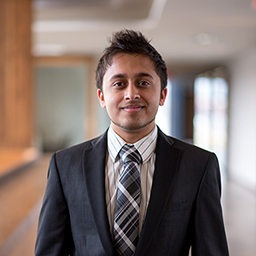
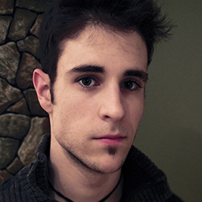

# 

YOOOOOOOOO

Lit is a heat map event tracker that displays current and future events. Each event will be defined by an area on the map with geo-fencing using Google Maps API. A user who enters the defined area will add to the event counter - which displays how many users are within that event’s area. The density of people will be visually displayed through color. For example: events of low, medium, and high user density will be filled in with yellow, orange, and red colours respectively. By clicking or tapping on the event area, a user can see more information about that specific event. A time slider will allow the user to view events on the map at later points in time.

## Members

### Anirudha Nandi

Nandi is a second year computer science student at Western University. He is from Milton, Ontario but was originally born in India. He plans on attending the Richard Ivey School of Business next year to double major in Computer Science and Business Administration. Nandi has been coding since he was 11 and can code in C, C#, C++, Java, and Python. He also works at RezNet, the Internet Service Provider at Western University. Fun fact: Nandi crashed his car into a 80 year old lady.

**anandi@uwo.ca**

### Mitch Mancuso

Mitch is a fourth year computer science student at the University of Western Ontario. Over the years he has maintained a portfolio of design and operational projects utilizing knowledge in Swift, Filemaker, Oracle, HTML, CSS, PHP and SQL. Hobbies include: spending way too much time on the internet, and losing track of time.

**mmancus4@uwo.ca**

### Yuhan Li 

Yuhan is a third year student double major in Financial Modeling and Computer Science at Western University. Throughout studies, he is proficient in Java, Python, Matlab,C,SQL, mongoDB, Excel(VBA). Yuhan has a wide range of interests. He created the Western Magic Community to become the largest magician club in London, ON. Hobbies includes: photoshooting, boxing and video editing.

**Contact:**

**[Personal Web](https://www.liyuhan.me)**    
**[Linkedin](https://ca.linkedin.com/in/yuhan-li-5b07b896)**    
**[Email](yli2422@uwo.ca)**

## Application

## Features

## Design

## UI

## Software

## Roles

