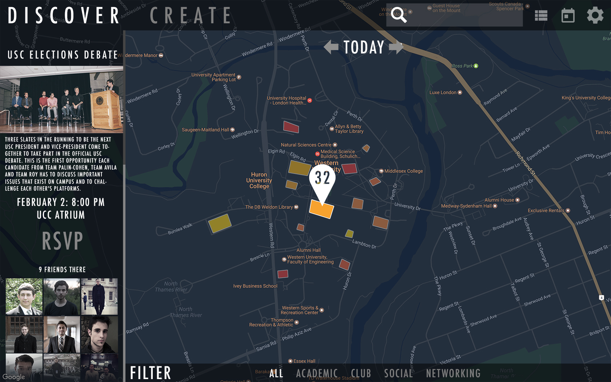
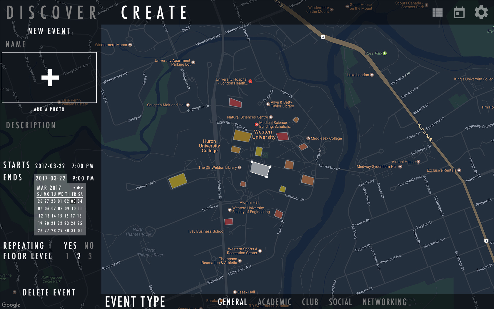
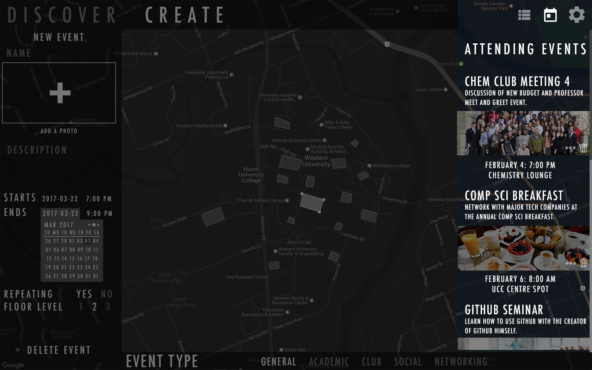

<!---
Computer Science 2212 - Introduction to Software Engineering is a course designed to examine the stages of the software engineering process, including requirements gathering, specification, design, implementation, and testing. Students of CS 2212 are required to work cooperatively in a team to design and implement a moderately large software system.

LIT is a heat map event tracker that displays current and future events. Each event will be defined by an area on the map with geo-fencing using Google Maps API. A user who enters the defined area will add to the event counter - which displays how many users are within that event’s area. The density of people will be visually displayed through color. For example: events of low, medium, and high user density will be filled in with yellow, orange, and red colours respectively. By clicking or tapping on the event area, a user can see more information about that specific event. A time slider will allow the user to view events on the map at later points in time.

1. Create geo-fenced events

2. Users can discover events around them using a heat map

3. Facebook integration for easy login and event sharing

*Developed by Team 13 for CS 2212*

## MEMBERS

### ANDRE ZEKIC

Andre is a fourth year student at Western University pursuing a double major in Chemistry and Computer Science. He is often seen speeding across campus on his electric longboard or drinking concerning amounts of Soylent. His position as *Computer Science Representative* and *VP of Promotions* on Western’s *Science Student’s Council* and the *Chemistry Club* respectively brought insight towards a concerning truth – councils, clubs, and societies across campus have no standardized method to communicate with students. Students are left to figure out whats going on across campus on their own. From this insight came the inception of ‘Lit’, a service that aims to fill the gap and bring the events of all clubs and societies across campus directly to students.

**Role:** Project Lead, UI Lead
**azekic@uwo.ca**

### ANIRUDHA NANDI

Nandi is a second year computer science student at Western University. He is from Milton, Ontario but was originally born in India. He plans on attending the Richard Ivey School of Business next year to double major in Computer Science and Business Administration. Nandi has been coding since he was 11 and can code in C, C#, C++, Java, and Python. He also works at RezNet, the Internet Service Provider at Western University. Hobbies include: soccer, gaming, penetration testing on Linux, and coding.

**Role:** Back end developer
**anandi@uwo.ca**

### MITCH MANCUSO

Mitch is a fourth year computer science student at the University of Western Ontario. Over the years he has maintained a portfolio of design and operational projects utilizing knowledge in Swift, Filemaker, Oracle, HTML, CSS, PHP and SQL. Hobbies include: spending way too much time on the internet, and losing track of time.

**Role:** Framework Lead
**mmancus4@uwo.ca**

### YUHAN LI

Yuhan is a third year student double major in Financial Modeling and Computer Science at Western University. Throughout studies, he is proficient in Java, Python, Matlab,C,SQL, mongoDB, Excel(VBA). Yuhan has a wide range of interests. He created the Western Magic Community to become the largest magician club in London, ON. Hobbies includes: photoshooting, boxing and video editing.

**Role:** Back End Developer

**Contact:**

**[Personal Web](https://www.liyuhan.me)**    
**[Linkedin](https://ca.linkedin.com/in/yuhan-li-5b07b896)**    
**[Email](yli2422@uwo.ca)**

### MAKSYM KOVAL

Maksym is a second year student at western pursuing ] a dual-degree in Computer Science and Business Administration. He has always had an interest in merging business and computing. Initially involved in a student start-up as Vice President of Information Technology, he expanded his skills further upon entering university. Now as a Director of Technology at the Western Forex Association, he dedicates himself to site management and graphic design, while keeping a part time position at PPL as a Recreation Coordinator.

**Role:** Back End Developer

### YIJUN HE

Yijun is a second year computer science student at Western University who plans on doing Specilization in Computer Science. He is from China, and he likes music and graphic design. He started learning code last year and he can code in Java, C, Python, and HTML/CSS/Javascritpt.

**Role:** Front End Developer

**yhe362@uwo.ca**

 
Weija Zhou is a second year student at Western pursuing a Computer Science degree. He has always been interested in computers and electronics. He took an interest in computer science in high school. Throughout his life, he has gained skills in the mystical languages of python, java, C, C++, html, css, and javascript. He is excited about designing new projects and is committed to learning and being awesome. His official role on the team is being the "create" page developer. 
 
 **[wzhou94@uwo.ca](wzhou94@uwo.ca)**
 
### GARREN MCCALLUM

Garren is an avid technology enthusiast with an interest in anything computer or gaming related, with cars being a side hobby. He is particularly interested in the Android platform and enjoy making system modifications and changing Android versions on his mobile device. Garren is currently taking a Major in Computer Science and a Minor in Mathematics. He has experience in the Python, Java and C programming languages from past courses.

**Role:** Back End Developer
**gmccall5@uwo.ca**

### SPENCER ROEBOTHAM

Spencer is a third year computer science student at the University of Western Ontario. He has experience programming in Java, C, C++, Unix shell, ARM assembly, JavaScript, Ruby, HTML, and CSS. He is currently the VP Sponsorship of Western Cyber Security, a student-run organization at Western for those interested in ethical hacking and information security.

**Role:** Back End Lead

## UI DESIGN

The Login page allows a user to sign up, sign up with Facebook, or log into the appication.

The Sign Up page requests that a user fills in the necessary info to generate an account.

The Discover tab allows a user to find and interact with events.

The Create tab allows a user to create and edit an event.

The Active Events option lets a user browse current events in a timeline format and sort them by proximity, popularity, and date.

The Attending Events option lets a user view and modify the events they have chosen to attend.

The Settings option allows a user to modify their account, manage their events, and provides access to help resources.

## SOFTWARE DESIGN

## UML DIAGRAM

## PROJECT PLAN

## USER STORIES
-->
